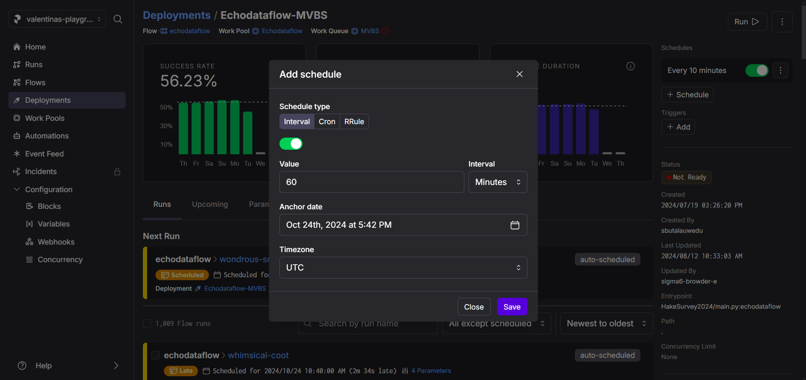
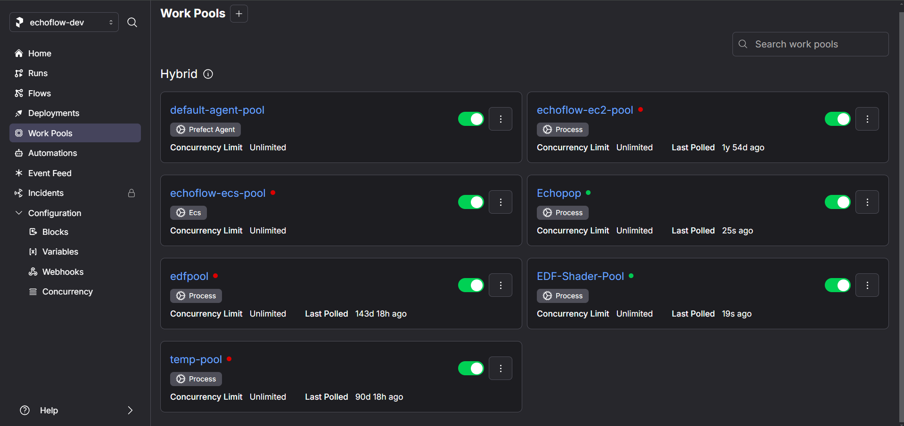
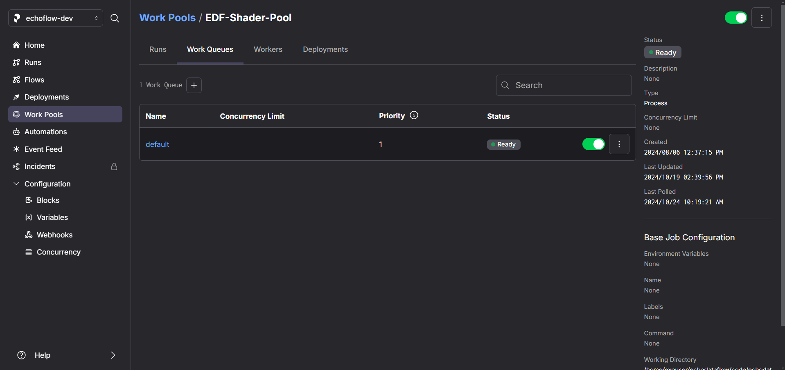
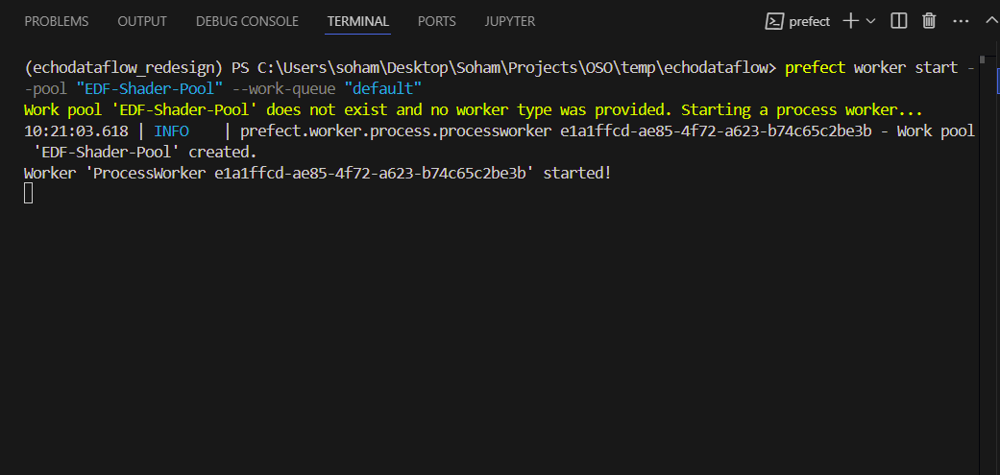

# Deployment Instructions

## Setting up the Environment

### Python Environment

1. Create and Activate Environment

    Start by creating a new conda, venv, or mamba environment and activate it.

    Example:

    ```bash
    conda create -n echodataflow_env python=3.10
    conda activate echodataflow_env
    ```

2. Clone Echodataflow

    Clone the echodataflow repository to your local machine:
    ```bash
    git clone https://github.com/OSOceanAcoustics/echodataflow
    cd echodataflow
    git checkout <HASH>
    ```

    Replace <HASH> with the specific commit hash (e.g., 9e31fc14ade5285f31c1a5d49e1a459457caae6b) to ensure consistency across deployments. Refer to the [environment snapshot](./environment_snapshot.txt) for the specific packages and versions used in the environment.

3. Install Echodataflow in Editable Mode

    Navigate to the cloned repository and install the package in editable mode:
    ```bash
    cd echodataflow
    pip install -e .
    ```

### Echodataflow configuration
1. Connect to Prefect Account

    Ensure your machine is connected to a Prefect account, which could be either a local Prefect server or a [Prefect Cloud account](https://docs.prefect.io/3.0/manage/cloud/connect-to-cloud).
2. Initialize Echodataflow

    In your environment, run the following command to set up the basic configuration for Echodataflow:

    ```bash
    echodataflow init
    ```
3. Create YAML Configuration Files
    
    Set up the YAML configuration files for each service to be deployed. Reference the [sample config files](https://drive.google.com/drive/u/2/folders/1C2Hs3-SxWbYaE3xTo7RRqAg4I7fzponW) for guidance and check the [documentation](https://echodataflow.readthedocs.io/en/latest/configuration/datastore.html) for additional information.
4. Add Required YAML Files

    Place the following YAML files in a directory. These files are required for the current deployment on Lasker or Shimada, if your use case is different feel free to modify the files accordingly:

    ```bash
    df_Sv_pipeline
    datastore.yaml
    pipeline.yaml
    datastore_MVBS.yaml
    pipeline_MVBS.yaml
    datastore_prediction.yaml
    pipeline_prediction.yaml
    ```

    The model path should be added to the `pipeline_prediction.yaml` file. The current model path is: `/Users/wu-junglee/HakeSurvey2024/models/binary_hake_model_1.0m_bottom_offset_1.0m_depth_2017_2019_ver_1.ckpt`. You can change the model path by modifying the model_path field in the `pipeline_prediction.yaml` file.

## Deploying the flows

1. Run Initial Scripts

    In the extensions folder of your environment, run `file_monitor.py` and `file_downloader.py`:

    ```bash
    python path/extensions/file_monitor.py
    python path/extensions/file_downloader.py
    ```
    Wait for the message "Your flow is being served and polling for scheduled runs!" to confirm that deployments have been created in your Prefect account.

2. Configure File Monitoring and File Transfer

    Configure the source for file monitoring and set up the `rclone` command for file transfer.

3. Run Main Deployment Script

    Run `main.py` from the deployment folder to create additional deployments: 

    ```bash
    python deployment/main.py
    ```
4. View and Edit Deployments in Prefect UI

    Go to the Prefect UI and check the Deployments tab to view the created deployments. You can duplicate deployments, modify schedules, and update datastore and pipeline configuration files directly from the UI.

5. Duplicate Deployments for Different Flows

    Create separate deployments for the Sv, MVBS, and prediction flows by duplicating the existing ones and customizing the schedule and configurations as needed.

6. Add Path to Configuration Files

    Update the deployment to include the correct paths to the YAML configuration files. If you're using S3 to manage config files, ensure to add the appropriate [block configuration](https://echodataflow.readthedocs.io/en/latest/configuration/blocks.html).

7. Adding Rules

    Echodataflow determines if a flow can run after a preceding flow by using configurable rules. These rules can be set up via CLI commands. For details on adding rules, refer to the [rules documentation](https://echodataflow.readthedocs.io/en/latest/cli/rules.html).

## Scheduling the flows

Each deployment has a schedule that determines when the flow will run. You can set the schedule to run at specific intervals, such as daily or hourly. You can also set the schedule to run on specific days of the week or at specific times of the day. Refer the below image for the schedule settings in the Prefect UI. Under a specific deployment, click on the "Schedule" button and set the schedule as per your requirement.




## Creating Work Pools and Work Queues
### Create Work Pools
In the Prefect UI, navigate to the Work Pools tab and create new pools. These pools can be distributed logically, such as one pool per service or per instance.



### Create Work Queues
Similarly, create work queues and assign them to the work pools. Distribute the queues in a way that optimizes load distribution across the available workers.  



Workpools and workqueues are essential for managing the distribution of tasks across multiple workers. This step can be executed at any time but should be done prior to spinning up the workers.

## Spinning Up Workers
### Start Workers
Once the work pools and queues are set up, you can start the workers. Prefect will provide commands for each pool and queue, which you can run to spin up workers on the instance.

Example command:
```python
prefect worker start --pool 'Sv-Processing-Pool'
```

### Run Workers in Parallel
Each worker command should be executed in a separate terminal session. This will allow multiple workers to run in parallel, processing tasks across different flows simultaneously. Below is a snapshot of the terminal sessions to illustrate:



## Deploying Visualization Panels

### Echopop and Echoshader

To deploy the visualization panels, you will need to set up the Echopop and Echoshader services. These services will help process the data and provide it in a way suitable for visualization. For more information on what the services do, please refer to the [Echopop](https://echopop.readthedocs.io/en/latest/) and [Echoshader](https://echoshader.readthedocs.io/en/latest/) documentation.

Make two duplicates of any of the deployments created using main.py from the Prefect UI and use them for Echopop and Echoshader services. In the deployment configuration, change the work pool and work queue to new ones created specifically for Echopop and Echoshader services. Once created, change the deployment input paths of the files to ensure they point correctly to the config files present on the machine. On a machine, spin up the workers following the above instructions.

#### Echopop

There are two services that need to be deployed for Echopop: one for extracting bio-related information from the ship (bio flow) and another for processing NASC data (NASC flow). Flows should be scheduled in Prefect to keep the data current when running in real-time.

For sample bio and NASC flows, please refer [here](https://drive.google.com/drive/u/2/folders/1C2Hs3-SxWbYaE3xTo7RRqAg4I7fzponW).

Echopop has its own configuration files. Please refer to the [Echopop](https://echopop.readthedocs.io/en/latest/) for more information on how to set up the configuration files.

Once the configuration files are set up, deploy the Echopop services in a similar manner to the previously deployed flows.

Echopop will create a local database, which is then used for deploying the visualization. Spin up a systemd process that calls the [Echopop panel extension service](../echodataflow/extensions/echopop_panel.py). The service will fetch the data from the database and display it in the panel. By default, it will be available at `http://localhost:1800`.

### Echoshader

Echoshader can be deployed in a similar way as the previously deployed flows. Find the sample config [here](https://drive.google.com/drive/u/2/folders/1W8Biq6on2AeK4XOneaxBh8l_B5uo-cj6). Echoshader will extract data from the specified source and store it locally on the machine. The service, similar to other services, should be scheduled in the Prefect UI. The data stored locally from the source files can be accessed using the [Echoshader panel extension service](../echodataflow/extensions/panel_app.py). The service will fetch the data from the local storage and display it in the panel. By default, it will be available at `http://localhost:1800`. Use the refresh button to update the panel.


